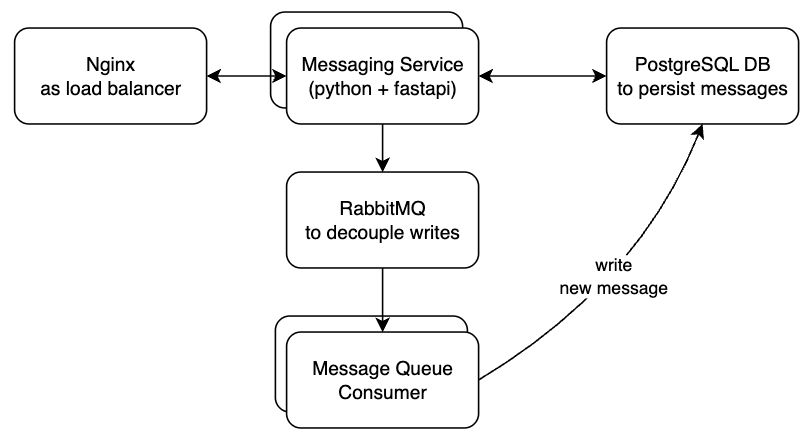

# Messaging Service API

A REST API for sending and retrieving messages built with FastAPI and SQLAlchemy.

## What's in this repo?



- **NGINX**: As reverse proxy round-robin load balancer
- **FastAPI Application**: REST API framework
- **Write Service**: Scalable write service that listens to message queue
- **SQLAlchemy Models**: Database models
- **RabbitMQ**: To decouple how messages are processed
- **PostgreSQL**: Database for persisting messages
- **Docker Support**: `docker-compose` to orchestrate multiple containers (nginx, messaging service, rabbitMQ and postgres)


## Project Structure

```bash
.
├── src/
│   ├── api/                    # REST api service  
│   ├── shared/                 # db, models, etc.
│   └── writer/                 # write service
├── docker-compose.yml          # to orchestrate the containers
├── Dockerfile                  # for api svc
├── Dockerfile.writer           # for write svc
├── Makefile
├── postman_collection.json
└── requirements.txt            # python dependencies
```


## How to run the service (using docker-compose)
### Prerequisites

- **Docker** (version 20.0+)
- **Docker Compose** (version 2.0+)
```sh
docker-compose up

# or us make command
make up
```

### 2. Access the API
- **API Base URL**: http://localhost:8000
- **Swagger Docs**: http://localhost:8000/docs
- **Health Check**: http://localhost:8000/

> Import [`postman_collection.json`](postman_collection.json) so that you can get started quickly.
`baseUrl` value in collection variables needs to be set to `http://localhost:8000`.

## API Endpoints

| Method | Endpoint | Description |
|--------|----------|-------------|
| GET | `/` | Health check |
| POST | `/messages` | Create a new message |
| GET | `/messages/{recipient_id}/new` | Fetch new messages for a user |
| GET | `/messages/{recipient_id}?start=1&stop=10` | Fetch paginated messages (start and stop are inclusive) |
| DELETE | `/messages/{id}` | Delete a specific message |
| DELETE | `/messages` | Delete multiple messages |

### Example Usage
```bash
# Create a message
curl --location 'http://localhost:8000/messages' \
--header 'Content-Type: application/json' \
--data '{
    "recipient_id": "receiver",
    "content": "test"
}'

# Fetch messages
curl "http://localhost:8000/messages?recipient_id=receiver&start=0&stop=9"
```